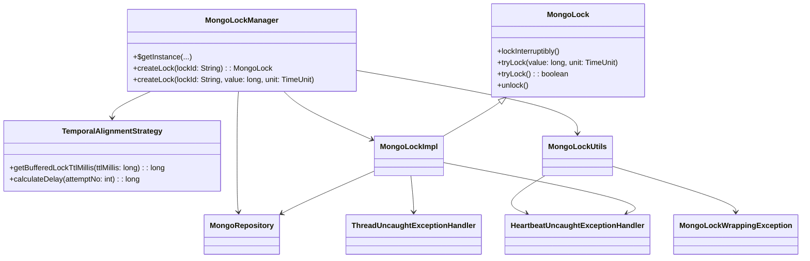
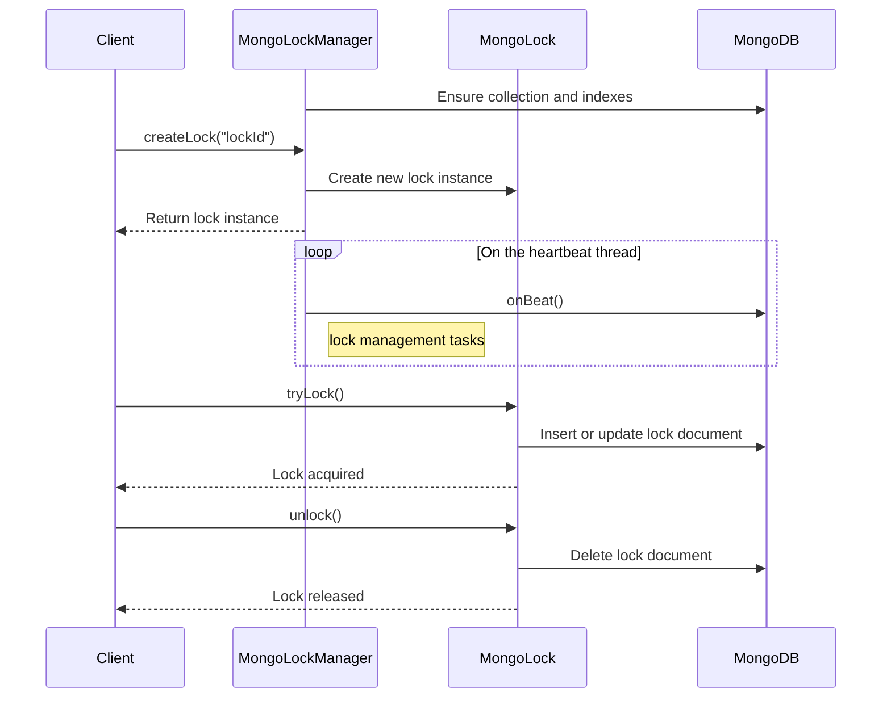
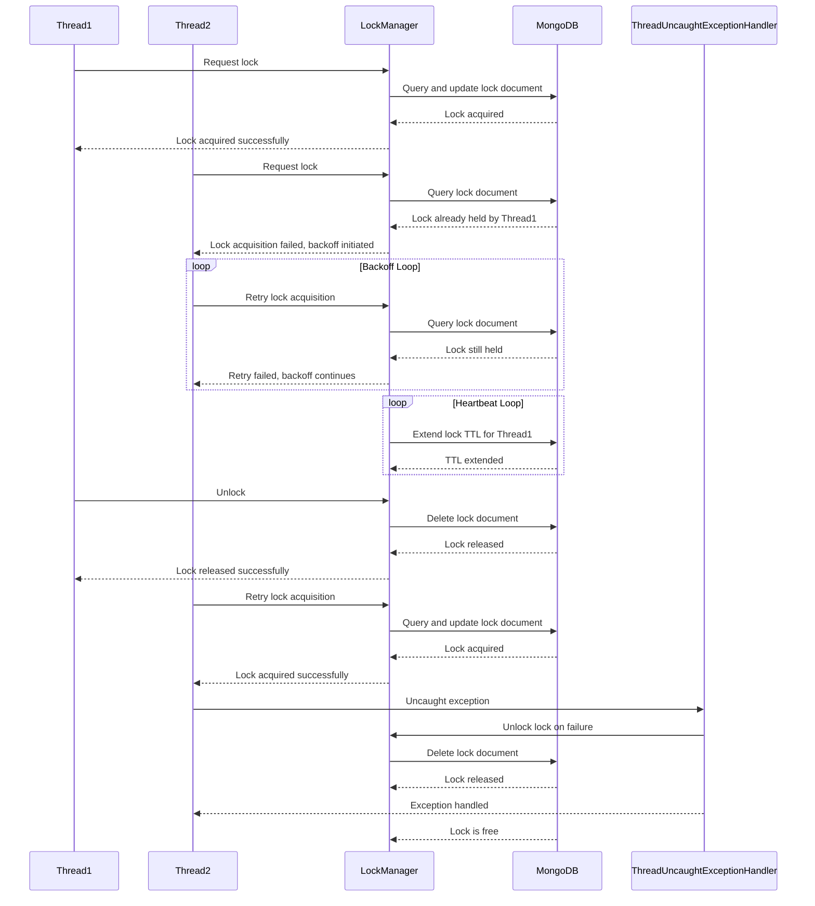

# MongoDB Pessimistic Locking System

<a href="https://github.com/iuliangoriac/mongo-lock/actions"></a>

This project implements a distributed pessimistic locking system using MongoDB as the backend. It is designed to handle
lock acquisition, renewal, and release in a distributed environment, ensuring robust concurrency control. The system is
particularly suitable for scenarios requiring strong consistency and resource coordination across distributed nodes.

## Table of Contents
<!-- TOC -->
* [MongoDB Pessimistic Locking System](#mongodb-pessimistic-locking-system)
  * [Overview](#overview)
  * [Key Features](#key-features)
  * [Architecture & Design](#architecture--design)
  * [How It Works](#how-it-works)
  * [Usage](#usage)
  * [Example: Distributed Order Processing System](#example-distributed-order-processing-system)
  * [Multiple thread interaction diagram](#multiple-thread-interaction-diagram)
  * [Configuration](#configuration)
  * [Conclusion](#conclusion)
<!-- TOC -->

---

## Overview

`MongoLockManager` provides a robust distributed locking mechanism using MongoDB. The system supports pessimistic
locking and offers **Managed Locks**. It ensures thread-safe and distributed lock management with features like
automatic lock expiration, exponential backoff for retries, and a heartbeat mechanism for extending lock lifetimes.

### Key Components:

- **The Lock Collection**: A dedicated MongoDB collection that stores lock metadata (e.g., lock ID, expiration time,
  lock owner ID, lock specific TTL interval).
- **Exponential Backoff**: A strategy used to reduce contention during lock acquisition retries.
- **Heartbeat Mechanism**: A singleton thread (pe JVM) that manages the lifecycle of the locks: automatic lock TTL
  extension and cleanup.
- **Flexible API**: Similar
  to [java.util.concurrent.locks.Lock](https://docs.oracle.com/javase/8/docs/api/java/util/concurrent/locks/Lock.html)
  interface.

### Why MongoDB backed Pessimistic Locking:

An unjustly brief introduction will start with ACID transactions:

- **A**_tomicity_ - Transactions are all-or-nothing; fully complete or fully rollback.
- **C**_onsistency_ - Transactions maintain database validity, adhering to predefined rules and constraints.
- **I**_solation_ - Concurrent transactions execute independently without interfering with each other.
- **D**_urability_ - Committed transactions are permanently saved, even after system failures.

Isolation levels in database systems are mechanisms to control the visibility of data changes between transactions,
ensuring data consistency and integrity.
These levels are implemented using **pessimistic locking** or **optimistic locking**, depending on the approach chosen
by the database or application.

###### **Key Differences**

| **Aspect**             | **Pessimistic Locking**                                                                                                            | **Optimistic Locking**                                                                |
|------------------------|------------------------------------------------------------------------------------------------------------------------------------|---------------------------------------------------------------------------------------|
| **Conflict Handling**  | Proactively prevents conflicts by locking resources.                                                                               | Detects conflicts at commit time.                                                     |
| **Retry Logic**        | Rarely required as conflicts are prevented upfront.                                                                                | Required to handle conflicts when detected.                                           |
| **Concurrency**        | When ensuring data integrity is more important than maximizing concurrency.                                                        | When maximizing concurrency is a priority, and conflicts are rare.                    |
| **Data Sensitivity**   | Critical when data integrity is paramount, such as financial transactions.                                                         | Appropriate for non-critical updates where occasional retries are acceptable.         |
| **Performance Impact** | Suitable for environments where locking overhead is acceptable due to fewer users.                                                 | Suitable for high-read, low-write environments where locking is avoided.              |
| **Implementation**     | Typically involves database-level locks (e.g., row-level or table-level locks).                                                    | Often implemented using versioning (e.g., timestamps or version numbers).             |
| **Risk of Deadlocks**  | Higher risk of deadlocks due to locking resources for extended periods.                                                            | No risk of deadlocks as no locks are held.                                            |
| **Use Case**           | Scenarios with high contention or frequent concurrent updates to the same data.                                                    | Scenarios with low contention or infrequent concurrent updates to the same data.      |
| **Example Use Cases**  | - Bank account transfers<br>- Inventory management with high contention<br>- Reservation systems where overbooking is unacceptable | - User profile updates<br>- Shopping cart updates<br>- Collaborative document editing |

MongoDB does not natively support **pessimistic locking** (like traditional relational databases using
`SELECT ... FOR UPDATE`).
MongoDB's design philosophy emphasizes high availability, scalability, and performance, which aligns more with
**optimistic concurrency control** through mechanisms like versioning (`$inc`, `$set`, `$currentDate`, etc.) or the
`findAndModify` operation.
More details in [MongoDB - FAQ: Concurrency](https://www.mongodb.com/docs/manual/faq/concurrency/#faq--concurrency).

However, to implement pessimistic locking in MongoDB, it can simulated by using the following approaches (the list is
not exhaustive):

1. **Use a "Lock" Field in Documents**
    - **Pros**: Simple and works for many use cases.
    - **Cons**: Requires careful handling of lock expiration to avoid deadlocks.
2. **Use a Separate Lock Collection**
    - **Pros**: Cleaner separation of locking logic.
    - **Cons**: Requires an additional collection and careful cleanup of expired locks.
3. **Use a distributed locking library like _Redlock_ or implement a similar pattern with MongoDB**
    - **Pros**: A robust and reusable distributed locking mechanism that ensures consistency across multiple nodes.
    - **Cons**: Introduces additional setup complexity and potential performance overhead due to cross-node
      coordination.

The solution presented here is offered as a (criticizable) reference implementation of the second approach mentioned
above
and also as a serious consideration for the last one.

---

## Key Features

- **Distributed Locking**: Locks are stored in a MongoDB collection, making them accessible across distributed systems.
- **Thread Safety**: Locks are designed to be thread-safe, ensuring safe concurrent access in multithreaded
- **Customizable Lock Behavior**: Configurable TTL, heartbeat intervals, and retry strategies.
- **Exponential Backoff with Jitter**: Retry strategies for lock acquisition to reduce contention.
- **TTL-based Expiration**: Locks have a time-to-live (TTL) to prevent deadlocks caused by abandoned locks.
- **Reentrant Locking**: Allows the same thread to re-acquire a lock it already owns.
- **Heartbeat Mechanism**: Active locks are periodically renewed to maintain their validity. Locks owned by terminated
  threads are automatically released

---

## Architecture & Design

The system is composed of the following components:

### 1. **MongoLock**

- An interface defining the core locking operations: `lockInterruptibly`, `tryLock`, and `unlock`.
- Locks are stored as documents in a MongoDB collection and MongoDB properties ensures mutual exclusion in distributed
  environments

### 2. **MongoLockImpl**

- Implements the `MongoLock` interface.
- Manages individual lock instances, including metadata such as owner ID, TTL, and thread ownership.
- Handles lock acquisition, renewal, and release.

### 3. **MongoLockManager**

- Central manager for creating and maintaining locks.
- Provides singleton instances per MongoDB connection and collection.
- Manages the heartbeat mechanism for periodic lock renewal and cleanup.
- Releases locks owned by threads that are no longer alive.
- Periodic cleanup of expired locks to prevent stale entries in the database.
- Implements thread-safe operations using synchronized sets and atomic references.

### 4. **TemporalAlignmentStrategy**

- Defines strategies for managing TTL, heartbeat intervals, and retry delays.
- Implements exponential backoff with jitter for lock acquisition retries.
- Exponential backoff prevents excessive contention by introducing delays between retries.
- Jitter is added to avoid synchronized retries across threads.

### 5. **MongoLockUtils**

- Utility class for shared functionality, such as handling MongoDB write exceptions and managing heartbeats.
- Heartbeat is implemented via pooled ScheduledExecutorService.

### 6. **HeartbeatUncaughtExceptionHandler**

- Ensures the heartbeat thread continues running even if unexpected exceptions occur.

### 7. **ThreadUncaughtExceptionHandler**

- Releases locks held by threads that terminate unexpectedly due to uncaught exceptions.

### 8. **MongoLockWrappingException**

- A custom runtime exception for encapsulating low-level MongoDB exceptions in lock operations.

### 9. **MongoRepository**

- Encapsulates all communication with MongoDB server.


### Component Interaction



---

## How It Works

### Lock Lifecycle

1. **Creation**: A lock is created using `MongoLockManager.createLock()`.
2. **Acquisition**: The lock is acquired using `lockInterruptibly()` or `tryLock()`.
   If the lock is unavailable, retries are managed with exponential backoff and jitter.
3. **Renewal**: The heartbeat mechanism periodically extends the TTL of active locks.
4. **Release**: Locks are explicitly released using `unlock()` or automatically cleaned up if expired or orphaned.



### Heartbeat Mechanism

- A scheduled task runs periodically to:
    - Extend the TTL of active locks.
    - Clean up expired locks.
    - Release locks held by terminated threads.
    - Synchronize the server-client time delta for accurate TTL calculations.

---

## Usage

1. **MongoDB Connection**:
   Ensure a MongoDB instance is running and accessible.
   ```java
   MongoClient mongoClient = MongoClients.create("mongodb://localhost:27017");
   MongoLockManager lockManager = MongoLockManager.getInstance(mongoClient);
   ```

2. **Creating a Lock with the default TTL**:
   ```java
   MongoLock lock = lockManager.createLock("myLock");
   ```

3. **Creating a Lock with a user-defined TTL**:
   ```java
   MongoLock lock = lockManager.createLock("myLock", 15, TimeUnit.SECONDS);
   ```

4. **Acquiring a Lock**:
   ```java
   try {
       lock.lockInterruptibly(); // Blocks until the lock is acquired
       // Perform critical section
   } catch (InterruptedException e) {
       Thread.currentThread().interrupt();
   } finally {
       lock.unlock();
   }
   ```
   or
   ```java
   try {
       // Blocks until the lock is acquired but no more than 10 seconds
       if (lock.tryLock(10, TimeUnit.SECONDS)) { 
           // Perform critical section
       } 
   } catch (InterruptedException e) {
       Thread.currentThread().interrupt();
   } finally {
       lock.unlock();
   }
   ```
   or
   ```java
   try {
       if (lock.tryLock()) { // No block: fails or succeeds instantly
           // Perform critical section
       }
   } finally {
       lock.unlock();
   } 
   ```

5. **Releasing a Lock**:
   ```java
   lock.unlock();
   ```
---

## Example: Distributed Order Processing System

#### Problem:

Imagine an e-commerce platform where multiple services process customer orders concurrently. Each order must be
processed exactly once to avoid issues like double charging or duplicate shipments. Since these services are distributed
across multiple servers, a mechanism is needed to ensure that only one service processes a specific order at a time.

#### Solution:

Use the `MongoLockManager` to implement distributed locking. Each service attempts to acquire a lock on the order ID
before processing it. The heartbeat mechanism ensures that locks are not prematurely released during long-running
operations, even under high load or network delays.

---

### How to Use the Implementation

#### Step 1: Initialize the MongoDB Lock Manager

First, set up a MongoDB instance and connect to it using the `MongoLockManager`. The lock manager will use a MongoDB
collection to store lock metadata.

```java
import com.mongodb.client.MongoClients;
import com.mongodb.pessimistic.heartbeat.MongoLockManager;

public class LockManagerSetup {
    public static MongoLockManager initializeLockManager() {
        var mongoClient = MongoClients.create("mongodb://localhost:27017");
        return MongoLockManager.getInstance(mongoClient);
    }
}
```

---

#### Step 2: Acquire a Lock Before Processing an Order

Each service attempts to acquire a lock on the order ID before processing it. If the lock is successfully acquired, the
service proceeds with processing; otherwise, it retries with exponential backoff.

```java
import com.mongodb.pessimistic.heartbeat.MongoLock;
import com.mongodb.pessimistic.heartbeat.MongoLockManager;

import java.util.concurrent.TimeUnit;

public class OrderProcessor {
    private final MongoLockManager lockManager;

    public OrderProcessor(MongoLockManager lockManager) {
        this.lockManager = lockManager;
    }

    public void processOrder(String orderId) {
        MongoLock lock = lockManager.createLock(orderId, 10, TimeUnit.SECONDS); // Lock TTL: 10 seconds

        try {
            if (lock.tryLock(5, TimeUnit.SECONDS)) { // Try acquiring the lock within 5 seconds
                LOGGER.info("Lock acquired for order: " + orderId);
                // order processing
                Thread.sleep(2000); // Processing takes 2 seconds
                LOGGER.info("Order processed: " + orderId);
            } else {
                LOGGER.error("Failed to acquire lock for order: " + orderId);
            }
        } catch (InterruptedException e) {
            LOGGER.error("Lock acquisition interrupted for order: " + orderId);
        } finally {
            lock.unlock(); // Release the lock
            LOGGER.error("Lock released for order: " + orderId);
        }
    }
}
```

---

## Multiple thread interaction diagram



### Key Highlights of the Diagram:

1. **Multiple Threads Acquiring the Lock**:
    - Thread1 acquires the lock successfully.
    - Thread2 attempts to acquire the same lock but is denied as it's already held by Thread1.

2. **Lock Release**:
    - Thread1 releases the lock, allowing Thread2 to retry and acquire it successfully.

3. **Thread Failure**:
    - Thread2 encounters an exception during execution.
    - The `ThreadUncaughtExceptionHandler` ensures the lock is released to prevent deadlocks.

4. **Heartbeat Mechanism**:
    - The `MongoLockManager` periodically extends the TTL of active locks to prevent expiration while the lock is still
      in use.

5. **Thread Completion**:
    - Threads release the lock upon completing their work, ensuring proper cleanup in the MongoDB collection.

---

## Configuration

### Database Access Rights

Considering that the locks collection namespace is `MongoLocks.pessimisticLocks`
the minimal set of permissions required for this solution to work is:

- **insert**      @ MongoLocks (*pessimisticLocks*)
- **find**        @ MongoLocks (*pessimisticLocks*)
- **update**      @ MongoLocks (*pessimisticLocks*)
- **remove**      @ MongoLocks (*pessimisticLocks*)
- **createIndex** @ MongoLocks (*pessimisticLocks*)

In addition, in order to run the _tests_ the following set of rights will have to be granted to `MongoLocks.pessimisticLocks`<u>`Test`</u>:

- **insert**         @ MongoLocks (*pessimisticLocksTest*)
- **find**           @ MongoLocks (*pessimisticLocksTest*)
- **update**         @ MongoLocks (*pessimisticLocksTest*)
- **remove**         @ MongoLocks (*pessimisticLocksTest*)
- **createIndex**    @ MongoLocks (*pessimisticLocksTest*)
- **dropCollection** @ MongoLocks (*pessimisticLocksTest*)

### Environment Variables
- **`DEFAULT_LOCK_TTL_MILLIS`**: Overrides the default lock TTL (default: `5000ms`).
- **Minimum TTL**: Enforced at `500ms` to ensure safety.

### Temporal Strategy
- Default heartbeat interval: `TTL / 3`.
- Default exponential backoff: `Heartbeat Interval / 10`.

### Test Configuration

In order to run the tests an Atlas connection will be required.

The Atlas configuration will have to be put in a `config.json` file on the local drive, having the following structure:

```json
{
  "atlas": {
    "uri": "mongodb+srv://.../?appName=AXP",
    "userName": "admin",
    "password": "..."
  }
}
```

After this add an environment variable named `AXP_CONFIG_JSON_PATH` with the path to the config file
`C:\Users\my.name\...\config.json`.

## Conclusion

The `MongoLockManager` provides a robust and flexible locking mechanism for distributed systems. By leveraging MongoDB's
capabilities, it ensures reliable and efficient lock management. The system's support for both basic and managed locks
makes it suitable for a wide range of use cases, from short-lived tasks to long-running operations.

This implementation addresses common locking challenges, such as deadlocks, contention, and resource leaks, making it a
valuable tool for developers building distributed applications.


