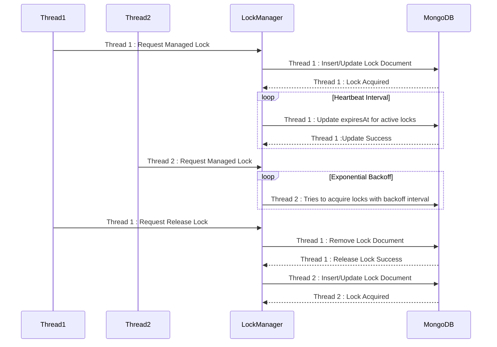

# MongoDB Pessimistic Locking System

 `MongoLockManager`   provides a robust distributed locking mechanism using MongoDB. The system supports pessimistic locking and offers two main types of locks: **Basic Locks** and **Managed Locks**. It ensures thread-safe and distributed lock management with features like automatic lock expiration, exponential backoff for retries, and a heartbeat mechanism for extending lock lifetimes.

---

## Overview

The `MongoLockManager` is a distributed lock manager built on MongoDB. It provides pessimistic locking, ensuring that only one thread or process can hold a lock for a resource at a time. The system is designed to be scalable, resilient, and suitable for distributed environments.

### Key Components:
- **Lock Collection**: A MongoDB collection that stores lock metadata (e.g., expiration time, owner ID).
- **Heartbeat Mechanism**: Extends the lifetime of managed locks to prevent expiration while in use.
- **Exponential Backoff**: Used to reduce contention during lock acquisition retries.
- **Thread-Safe Design**: Ensures safe concurrent access to locks.

---

## Features

- **Distributed Locking**: Works across multiple nodes in a distributed system.
- **Customizable TTL**: Locks can have a custom Time-To-Live (TTL).
- **Automatic Lock Expiration**: Expired locks are automatically cleaned up.
- **Heartbeat for Managed Locks**: Extends lock expiration time periodically.
- **Exponential Backoff**: Reduces contention during retries.
- **Reentrant Locking**: Allows the same thread to re-acquire a lock it already owns.

---

## Lock Types

### 1. Basic Lock
A **Basic Lock** is a simple lock with a fixed TTL. It does not automatically extend its lifetime and must be explicitly released.

#### Properties:
- Fixed TTL (default: 5000ms).
- Manual lock release.
- No automatic extension (no heartbeat).

#### Use Case:
- Short-lived operations where automatic extension is unnecessary.

---

### 2. Managed Lock
A **Managed Lock** is automatically extended while in use. This is achieved using a heartbeat mechanism that periodically updates the lock's expiration time.

#### Properties:
- Automatic TTL extension.
- Requires a heartbeat thread.
- Suitable for long-running operations.

#### Use Case:
- Long-running tasks that need to ensure the lock is not prematurely released.

---

## Lock Acquisition Options

The `MongoLockManager` provides multiple ways to acquire a lock:

### 1. `lock()`
Blocks the thread until the lock is acquired.

```java
lock.lock();
```

### 2. `lockInterruptibly()`
Blocks the thread until the lock is acquired or the thread is interrupted.

```java
lock.lockInterruptibly();
```

### 3. `tryLock()`
Attempts to acquire the lock immediately. Returns `true` if successful, `false` otherwise.

```java
if (lock.tryLock()) {
    // Lock acquired
} else {
    // Lock not acquired
}
```

### 4. `tryLock(long time, TimeUnit unit)`
Attempts to acquire the lock within a specified timeout.

```java
if (lock.tryLock(5, TimeUnit.SECONDS)) {
    // Lock acquired
} else {
    // Lock not acquired within timeout
}
```

---

## Implementation Details

### Design Properties:
1. **MongoDB-Based Lock Storage**:
    - Locks are stored as documents in a MongoDB collection.

2. **Heartbeat Mechanism**:
    - A scheduled task periodically extends the TTL of managed locks.
    - Expired locks are cleaned up during heartbeat.

3. **Exponential Backoff**:
    - Prevents excessive contention by introducing delays between retries.
    - Jitter is added to avoid synchronized retries across threads.

4. **Thread-Safe Design**:
    - Uses `ReentrantLock` and `Condition` for thread-safe lock acquisition and signaling.

---

## Usage Examples

### Creating a Basic Lock

```java
MongoLockManager lockManager = MongoLockManager.getInstance(mongoClient);
Lock basicLock = lockManager.newBasicLock("basicLockId");

basicLock.lock();
try {
    // Critical section
} finally {
    basicLock.unlock();
}
```

### Creating a Managed Lock

```java
MongoLockManager lockManager = MongoLockManager.getInstance(mongoClient);
Lock managedLock = lockManager.newManagedLock("managedLockId");

managedLock.lock();
try {
    // Critical section
} finally {
    managedLock.unlock();
}
```

### Using `tryLock` with Timeout

```java
if (managedLock.tryLock(5, TimeUnit.SECONDS)) {
    try {
        // Critical section
    } finally {
        managedLock.unlock();
    }
} else {
    System.out.println("Failed to acquire lock within timeout.");
}
```

---

## Diagrams

### Architecture Diagram

### Lock Lifecycle Diagram



---

## Conclusion

The `MongoLockManager` provides a robust and flexible locking mechanism for distributed systems. By leveraging MongoDB's capabilities, it ensures reliable and efficient lock management. The system's support for both basic and managed locks makes it suitable for a wide range of use cases, from short-lived tasks to long-running operations.

This implementation addresses common locking challenges, such as deadlocks, contention, and resource leaks, making it a valuable tool for developers building distributed applications.
